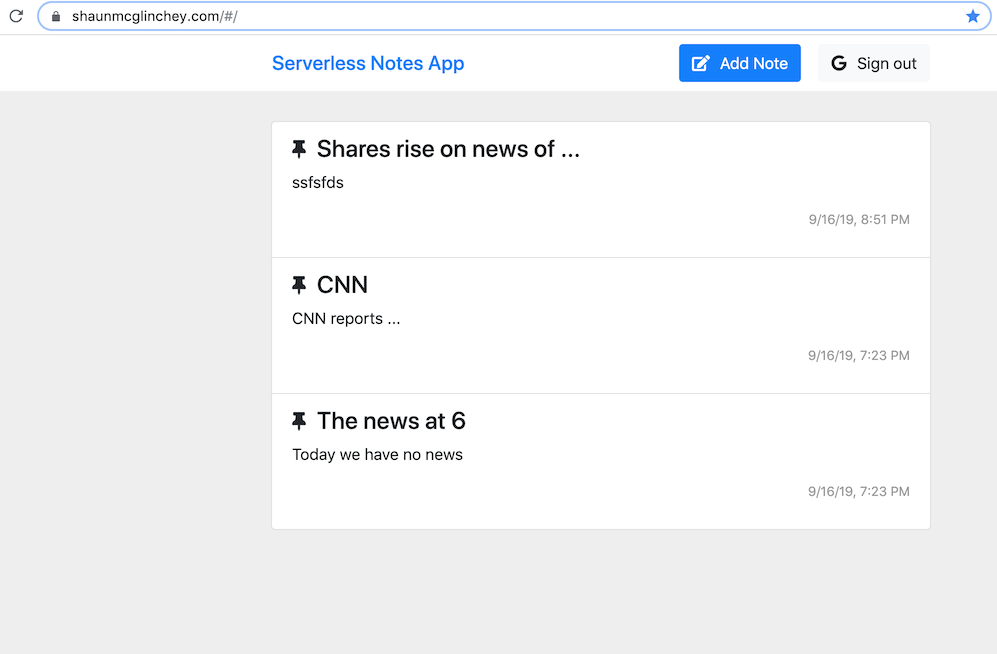

## Serverless notes web application

### URL  
https://shaunmcglinchey.com

### Login
Login using valid Google credentials

### Description
This simple web application supports CRUD (Create, Read, Update, Delete) of text notes. The frontend is an Angular-based SPA (Single Page Application). The static files are hosted in an S3 bucket and cached at the edge using AWS CloudFront. The backend is comprised of a collection of Node.js-based serverless functions coupled exposed via API Gateway routes that are in turn surfaced using a custom domain. Data is persisted to and retrieved from a document db (AWS DynamoDB). Authentication via Google credentials is supported. AWS resources are created using the Serverless Framework - infrastructure/resources are captured and committed to the source repository, making them easily reproducible.

### Credits
This serverless web application was built as part of the following training course: 
https://www.udemy.com/course/aws-lambda-serverless-architecture 

### Technologies used
- AWS S3
    - Static file hosting
- AWS Cognito
    - Authentication
- AWS Lambda
    - Serverless functions
- AWS API Gateway 
    - Public facing API Gateway providing event-based integration with Lambda functions
- AWS DynamoDB
    - Horizontally-scalable database 
- AWS Route53
    - Domain management
- AWS CloudFront
    - Edge hosting of static content
- AWS CodeCommit
    - Git-based source code repository
- AWS CodePipeline
    - CI/CD deployment pipeline
- AWS CloudWatch
    - Logging
- AWS Certificate Manager
    - Certificate management
- Serverless Framework
    - Infrastructure-as-code framework used for creation of AWS resources
- Angular 
    - Simple SPA
- Google Authentication
    - Integrated with AWS Cognito authorizer and Google API to support Gmail-based sign in
